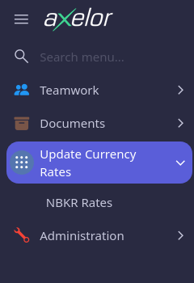
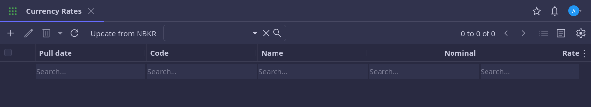

<h3>A demo axelor project fetching and saving daily currency rates from national bank.</h3>

Functionality:
--
- added menu item and page to manage currency rates
- added a button to manually update currency rates
- [non-finished] cron job running daily at 9AM to fetch/update daily currency rates
- all actions with rates are logged

Tech stack:
--
- Java 21 (21.0.7-zulu)
- Axelor Open Platform 8.0

 

